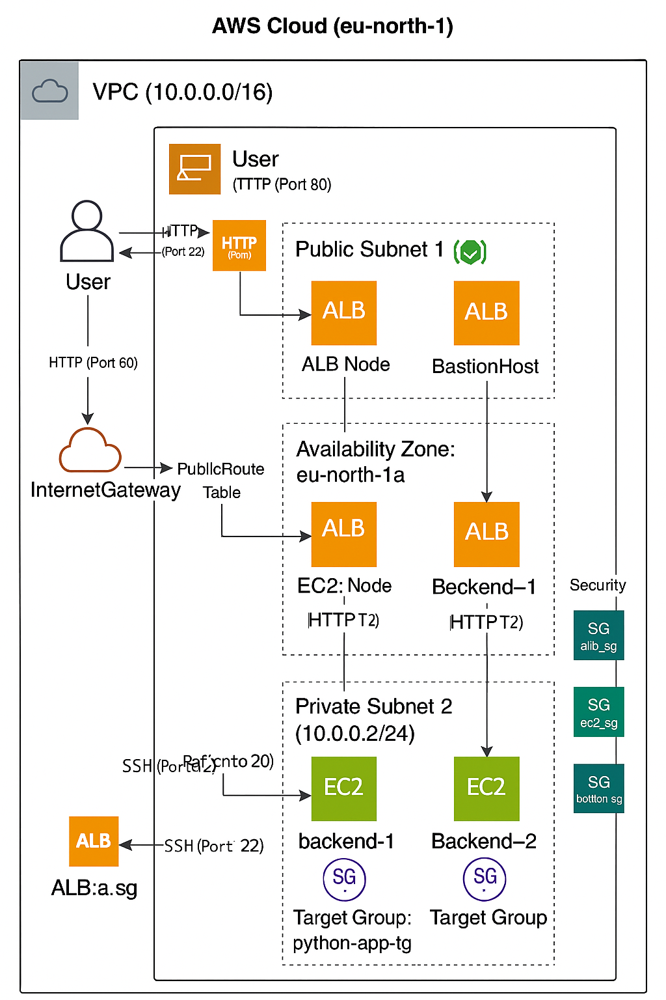

# ☁️ Terraform AWS WebApp Infrastructure



> **Multi-tier AWS infrastructure** using Terraform, featuring:
> - Public & private subnets across 2 AZs
> - EC2 backend instances running a Python HTTP server
> - Application Load Balancer (ALB)
> - Bastion Host for SSH access
> - All resources provisioned via Infrastructure as Code (IaC)

---

## 🔧 Stack

- **AWS Services:**
  - VPC, Subnets, Route Tables
  - EC2 Instances (Bastion + Backend)
  - Security Groups
  - Application Load Balancer
  - Target Group with Health Checks
- **Terraform:** Infrastructure as Code

---

## 🗂️ Project Structure

```bash
terraform-aws-webapp/
├── main.tf              # All infrastructure definitions
├── variables.tf         # Input variables
├── outputs.tf           # Useful output values (e.g., ALB DNS)
├── terraform.tfvars     # Variable values (region, AMI, etc.)
└── assets/
    └── IaC.png  # Network diagram
